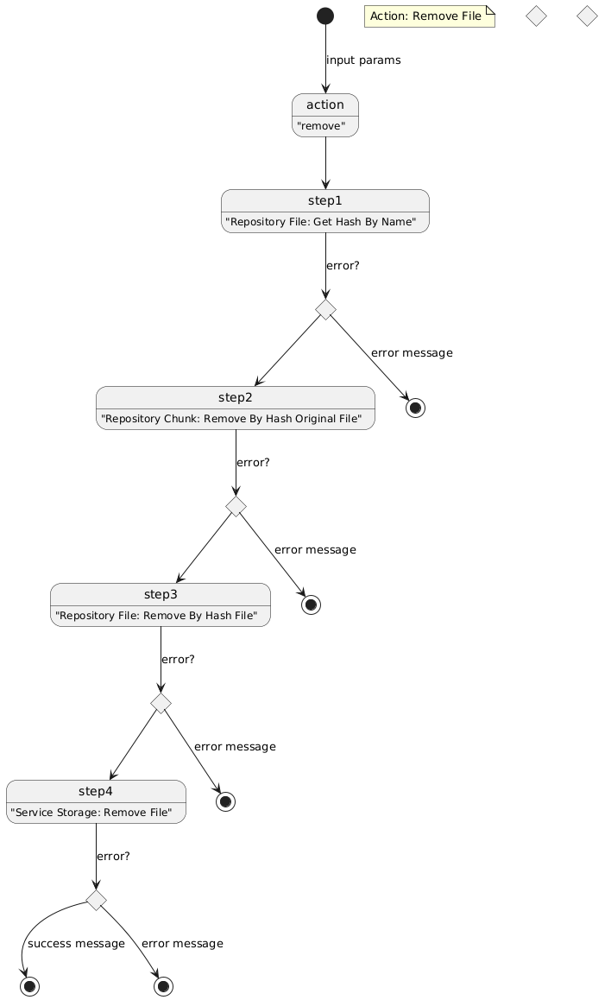
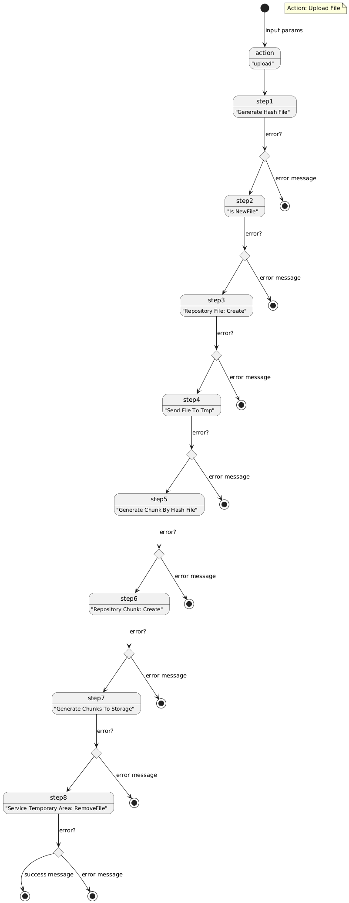

# Documentação
A documentação se baseia em diagramas que explica o sofware desenvolvido.

## Diagrama de componentes

A aplicação usa diversas pastas em disco para realizar o processamento:
- **input_file_examples**: Pasta com exemplos de arquivos .txt para uso de input.
- **tmp_file**: Pasta de arquivos temporários usado no processamento de arquivos.
- **storage**: Pasta de arquivos .bin, pedaços do arquivo original.
- **config**: Pasta de arquivos auxiliares para ajudar a manter o controle do que foi processado.
- **log**: Pasta de arquivo de log de atividade e de erro.

## Actions diagramas
Embora foi usado o diagrama de estado do PlantUML, o seu uso está mais parecido como um fluxograma. Para ajudar na futura comparação quando cada action terá estados bem definidos em cada etapa, já foi adotado o diagrama de estado. É importante observar que em caso de falha independete da etapa, o fluxo é desviado para finalização, compromentendo a integridade dos dados.

## Action: Clear

O input da action esperado é "clear" e segue as etapas:
- *Reset chunk collection*: Reset coleção de chunk para seu estado vazio, estado inicial.
- *Reset hash collection*: Reset coleção de hash para seu estado vazio, estado inicial.
- *Clean storage*: Apaga todos os arquivo de Storage.
- *Clean tmp*: Apaga todos os arquivos da pasta temporária.
- *Clean log error*: Apaga o conteúdo do log de erro.
- *Clean log atividade*: Apaga o conteúdo do log de atividade.

## Action: Download

O input da action esperado é "download", necessário input do nome do arquivo alvo e segue as etapas:
- *Get hash by file name*: Pega hash do arquivo solicitado.
- *Get chunks by hash*: Pega a árvore de chunks do arquivo solicitado.
- *Generate file by chunks*: Gera o arquivo final por meio dos chunks.

## Action: Remove

O input da action esperado é "remove", necessário input do nome do arquivo alvo e segue as etapas:
- *Get hash by file name*: Pega o hash do arquivo.
- *Get chunks by hash*: Pega a árvore de chunks.
- *Is chunk can be removed*: Verifica se o chunk pode ser removido.
- *Remove chunk bin*: Remove chunk do storage.
- *Remove hash file to chunk collection*: Remove item _hash do arquivo_ da coleção de chunk.
- *remove hash to collection*: Remove item _hash do arquivo_ da coleção de hash.

## Action: Upload

O input da action esperado é "upload", necessário input do arquivo com caminho completo e segue as etapas:
- *Is new file*: Verifica se o arquivo é novo.
- *Add hash to collection*: Adiciona o hash na coleção de hash.
- *Send file to tmp*: Envia o arquivo para pasta temporária.
- *Proces chunk*: Processa os chunks do arquivo, envia para storage.
- *Remove file to tmp*: Remove arquivo da pasta temporária.

[README](./README.md)