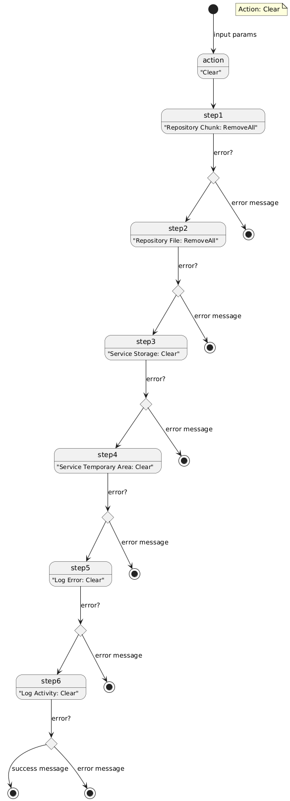

# Documentação
A documentação se baseia em diagramas que explica o sofware desenvolvido.

## Diagrama de componentes

A aplicação usa diversas pastas em disco para realizar o processamento:
- **input_file_examples**: Pasta com exemplos de arquivos .txt para uso de input.
- **tmp_file**: Pasta de arquivos temporários usado no processamento de arquivos.
- **storage**: Pasta de arquivos .bin, pedaços do arquivo original.
- **log**: Pasta de arquivo de log de atividade e de erro.
- **collection**: Coleção de dados, pode ser em Json ou SQLite

## Actions diagramas
Embora foi usado o diagrama de estado do PlantUML, o seu uso está mais parecido como um fluxograma. Para ajudar na futura comparação quando cada action terá estados bem definidos em cada etapa, já foi adotado o diagrama de estado. É importante observar que em caso de falha independete da etapa, o fluxo é desviado para finalização, compromentendo a integridade dos dados.

## Action: Clear

## Action: Download

## Action: Remove

## Action: Upload

[README](./README.md)